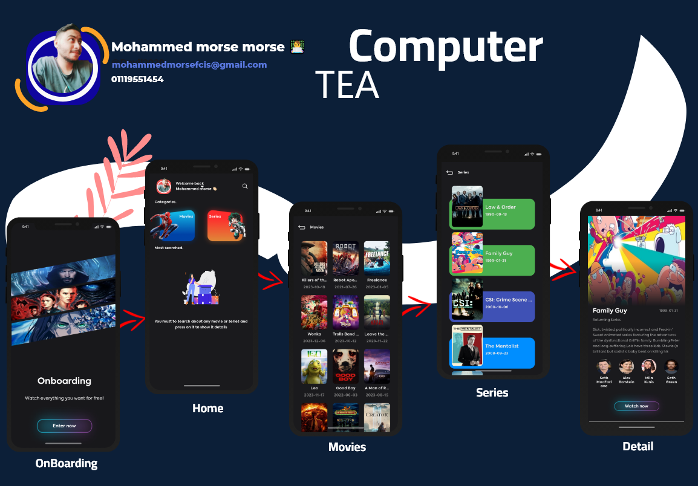

<h1 align="center">Tea Computer Task</h1>

     

  
   upon running the application you will face a OnBoarding screen , then you will find Home screen if we just press on Movies or Series it will get your specific data , also when you search for any movie you will find the movie added to currently searched ./p>
 

## Download
Go to the [Releases](https://github.com/Devil2020/Bosta/releases/download/1.0.0/app-commonResources-debug.apk) to download the latest APK.

## Tech stack & Open-source libraries
- Minimum SDK level 21
- [Kotlin](https://kotlinlang.org/) based, [RX](https://kotlin.github.io/kotlinx.coroutines/kotlinx-coroutines-core/kotlinx.coroutines.flow/) for asynchronous.
- [Koin](https://dagger.dev/hilt/) for dependency injection.
- JetPack
    - Compose - declartive ui .
    - Lifecycle - dispose of observing data when lifecycle state changes.
    - ViewModel - UI related data holder, lifecycle aware.
    - RunTime Cashe construct a Cache using the abstract layer .
- Architecture
    - MVVM Architecture (View - ViewModel - Model)
    - Repository pattern
- [Retrofit2 & OkHttp3](https://github.com/square/retrofit) - construct the REST APIs and paging network data.
- [Room](https://github.com/square/retrofit) - construct the Cache .
- [Gson](https://github.com/square/moshi/) - A modern JSON library for Kotlin and Java.
- [Coin](https://square.github.io/picasso/)
- [Material-Components](https://github.com/material-components/material-components-android) - Material design components like ripple animation, cardView.

### License:
Copyright 2023 Mohammed Morse

Licensed under the Apache License, Version 2.0 (the "License");
you may not use this file except in compliance with the License.
You may obtain a copy of the License at

   http://www.apache.org/licenses/LICENSE-2.0

Unless required by applicable law or agreed to in writing, software
distributed under the License is distributed on an "AS IS" BASIS,
WITHOUT WARRANTIES OR CONDITIONS OF ANY KIND, either express or implied.
See the License for the specific language governing permissions and
limitations under the License.

